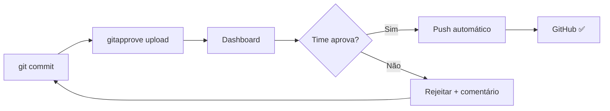

# 🚀 Guia Rápido - GitApprove

Comece a usar o GitApprove em **5 minutos**!

## 📦 Passo 1: Instalação (30 segundos)

```bash
npm install -g gitapprove
```

## 🔐 Passo 2: Autenticação (1 minuto)

```bash
gitapprove login
```

**O que acontece:**
1. ✅ CLI abre seu navegador automaticamente
2. ✅ Você vê a página: https://gitapprove.koyeb.app/dashboard/cli-auth
3. ✅ Clique em **"Gerar Código de Autenticação"**
4. ✅ Copie o código e cole no terminal
5. ✅ **Pronto!** Token salvo automaticamente em `~/.gitaprove/config.json`

**Se já estiver logado:**
```bash
gitapprove login
# ⚠️  Você já está autenticado!
# 👤 Usuário atual: seu-username
# Deseja fazer logout e autenticar novamente? (s/N):
```

## 💻 Passo 3: Primeiro Commit (2 minutos)

### 3.1. Fazer commits localmente

```bash
# No seu repositório
git add .
git commit -m "feat: minha primeira feature"
```

### 3.2. Enviar para aprovação

```bash
# ⚠️ NÃO USE: git push
# ✅ USE ISTO:
gitapprove upload owner/repo

# Exemplos:
gitapprove upload jotav96/meu-projeto              # Branch main (padrão)
gitapprove upload jotav96/meu-projeto -b develop   # Branch develop
gitapprove upload jotav96/meu-projeto --branch feature/nova-funcionalidade
```

**Saída esperada:**
```
📤 Preparando 1 commit(s) para envio...
  ✓ abc1234 - feat: minha primeira feature (3 arquivo(s))

📡 Enviando para GitApprove...
✓ 1 commit(s) enviado(s) com sucesso!

🔗 Ver no dashboard: https://gitapprove.koyeb.app/dashboard/pending
```

### 3.3. Aguardar aprovação

Seu time recebe notificação e pode:
- Ver o código no dashboard
- Aprovar ou rejeitar
- Adicionar comentários

### 3.4. Push automático! 🎉

Quando **todos os membros do time** aprovarem:
- ✅ Sistema faz `git push` automaticamente
- ✅ Commit aparece no GitHub
- ✅ Você recebe notificação

## 📋 Comandos Úteis

```bash
# Ver seus commits pendentes
gitapprove list

# Ver todos os commits (incluindo aprovados/rejeitados)
gitapprove list --all

# Ver seu status e estatísticas
gitapprove status

# Verificar se há atualizações do CLI
gitapprove update-check

# Ver ajuda completa
gitapprove --help
```

## 🎯 Workflow Completo



### Em texto:
1. **Você:** Faz commits localmente (`git add` + `git commit`)
2. **Você:** Envia para revisão (`gitapprove upload owner/repo`)
3. **Time:** Revisa no dashboard web
4. **Time:** Aprova ou rejeita com comentários
5. **Sistema:** Faz push automático quando todos aprovarem
6. **Pronto:** Código no GitHub! 🎉

## 🔧 Configuração de Projeto (Primeira vez)

### No Dashboard Web

1. Acesse: https://gitapprove.koyeb.app/dashboard/projects
2. Clique em **"Criar Novo Projeto"**
3. Selecione seu repositório GitHub
4. Configure o time de revisores
5. Salve!

### Proteger a Branch (Recomendado)

Para **impedir push direto** e forçar uso do GitApprove:

```bash
# Método 1: Git local
git config branch.main.pushRemote no-push
git config branch.develop.pushRemote no-push

# Método 2: GitHub Settings
# Acesse: github.com/owner/repo/settings/branches
# Add rule: Require pull request reviews before merging
```

## 🌿 Trabalhando com Branches

```bash
# Main (padrão)
gitapprove upload owner/repo

# Develop
gitapprove upload owner/repo --branch develop

# Feature branch
gitapprove upload owner/repo --branch feature/login

# Hotfix
gitapprove upload owner/repo -b hotfix/critical-bug

# Release
gitapprove upload owner/repo -b release/v2.0.0
```

## 🆘 Problemas Comuns

### ❌ "Invalid token"
**Solução:**
```bash
gitapprove login
# Faça login novamente para gerar novo token
```

### ❌ "Nenhum commit local para enviar"
**Solução:**
```bash
git log origin/main..HEAD
# Verifique se tem commits não enviados
# Se não houver, faça novos commits primeiro
```

### ❌ "Você não é membro do time responsável"
**Solução:**
- Peça ao dono do projeto para adicionar você ao time
- Dashboard → Projetos → Seu Projeto → Time → Adicionar Membro

### ❌ Push automático falhou
**Solução:**
1. Dono do projeto: faça logout e login no dashboard
2. Isso renova o token OAuth do GitHub
3. Tente aprovar novamente

## 📱 Usando o Dashboard

### Ver Commits Pendentes
https://gitapprove.koyeb.app/dashboard/pending

### Aprovar Commit
1. Clique no commit
2. Revise os arquivos (diff completo disponível)
3. Clique em **"Aprovar"**
4. (Opcional) Adicione comentário

### Rejeitar Commit
1. Clique no commit
2. Clique em **"Rejeitar"**
3. **Obrigatório:** Adicione comentário explicando o motivo
4. Desenvolvedor verá o feedback no CLI

### Ver Histórico
https://gitapprove.koyeb.app/dashboard/history

## 🎓 Próximos Passos

Agora que você sabe o básico:

- 📖 Leia o [README completo](./README.md) para recursos avançados
- ❓ Veja a [FAQ](./FAQ.md) para dúvidas específicas
- 📝 Confira o [CHANGELOG](./CHANGELOG.md) para novidades
- 🐛 Reporte bugs: https://github.com/jotav96/GitApprove/issues

## 💡 Dicas Pro

### 1. Alias úteis
```bash
# Adicione ao ~/.bashrc ou ~/.zshrc
alias gap='gitapprove upload'
alias gal='gitapprove list'
alias gas='gitapprove status'

# Uso:
gap owner/repo
gap owner/repo -b develop
```

### 2. Verificar antes de enviar
```bash
# Ver commits que serão enviados
git log origin/main..HEAD --oneline

# Ver arquivos modificados
git diff origin/main..HEAD --stat
```

### 3. Múltiplos commits de uma vez
```bash
# Todos os commits não enviados serão incluídos
git commit -m "feat: funcionalidade A"
git commit -m "fix: correção B"
git commit -m "docs: atualizar README"

gitapprove upload owner/repo
# Envia os 3 commits de uma vez!
```

### 4. Atalho do navegador
Adicione aos favoritos:
- Pendentes: https://gitapprove.koyeb.app/dashboard/pending
- Meus commits: https://gitapprove.koyeb.app/dashboard/approvals

---

## ✅ Checklist de Setup

- [ ] CLI instalado (`npm install -g gitapprove`)
- [ ] Login feito (`gitapprove login`)
- [ ] Projeto criado no dashboard
- [ ] Time configurado
- [ ] Branch protegida no GitHub (opcional mas recomendado)
- [ ] Primeiro commit enviado e aprovado
- [ ] Time entende o fluxo

**Tudo pronto?** Comece a usar! 🚀

---

**Dúvidas?** Veja a [FAQ](./FAQ.md) ou abra uma issue.
